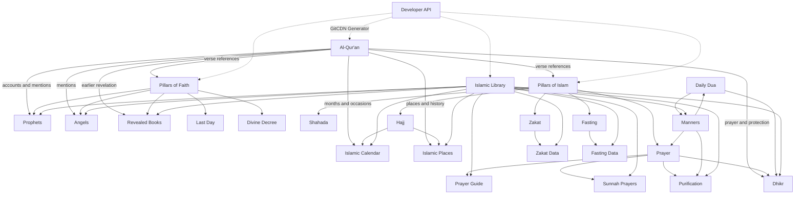

<p align="center">
  
</p>

<h1 align="center">Islamic JSON</h1>

<p align="center">All data json about Islam</p>

## Data Explorer

A Vue-based interface is included to browse the Qur'an, daily duas,
Asmaul Husna, the pillars of Islam, and the pillars of faith.

```bash
cd ui
npm install
npm run dev
```

The production site is built from the `ui` directory with `npm run build`
and deployed to GitHub
Pages automatically by `.github/workflows/deploy-pages.yml` whenever the
`main` branch is updated. In the repository settings, set **Pages → Source**
to **GitHub Actions**.

## Data Collections

- Qur'an, daily dua, dhikr, and Asmaul Husna
- Pillars of Islam and pillars of faith
- Obligatory and sunnah prayer guides
- Purification: wudu, tayammum, ritual bath, and impurities
- Angels, revealed books, and 25 prophets
- Hijri calendar and important Islamic occasions
- Major Islamic places
- Zakat and fasting references
- Daily manners for eating, sleeping, mosque, travel, visiting, and social life

Every domain includes a `README.md` describing its files, schema, and CDN
paths. The Vue explorer exposes these datasets under the **Library** and
**Developer API** navigation items.

## Data Relationships

The following diagram shows how primary sources, pillars, worship guides,
knowledge collections, and developer access relate to each other. An
interactive version is available on the **Data Relations** page in the UI.



## CDN

You can access _islamic json_ data free via CDN.

### 🚀 jsdelvr (Limit: Max 20 MB)

_Format_

`https://cdn.jsdelivr.net/gh/dyazincahya/islamic-json/{_DIR_}/{_FILENAME_}.json`

_Example_

https://cdn.jsdelivr.net/gh/dyazincahya/islamic-json/asmaul-husna/asmaul-husna.json

> 📝 asmaul-husna = `{_DIR_}` 📝 asmaul-husna.json = `{_FILENAME_}`.json

### 🚀 statically (Limit: Max 50 MB)

_Format_

`https://cdn.statically.io/gh/dyazincahya/islamic-json/{_BRANCH_}/{_DIR_}/{_FILENAME_}.json`

_Example_

https://cdn.statically.io/gh/dyazincahya/islamic-json/main/asmaul-husna/asmaul-husna.json

> 📝 main = `{_BRANCH_}` 📝 asmaul-husna = `{_DIR_}` 📝 asmaul-husna.json = `{_FILENAME_}`.json
